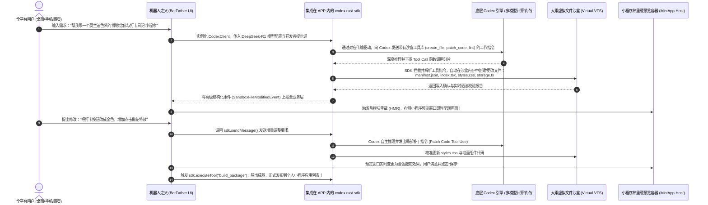
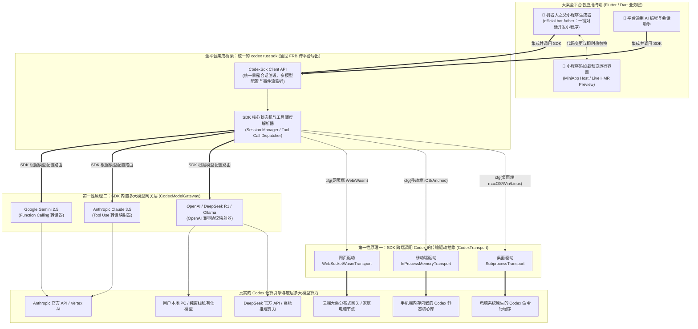

# 大乘全平台集成并使用 Codex 方案：以 Codex 为目标引擎，以 Codex Rust SDK 为统一调用工具 (PRD & Technical Blueprint)

## 1. 文档概述与核心架构逻辑：目标与工具的辩证统一

### 1.1 核心战略定位
立足于 **事实为本** 与 **第一性原理 (First Principles)**，我们要厘清系统架构中“终极目标”与“实施工具”的关系：
* **核心目标（What & Why）**：让大乘平台的**全平台（电脑桌面端、手机移动端 iOS/Android、Web 网页端）都能快速获得并真正使用 Codex 最新版的顶尖 AI 智能体能力**。包括自动上下文感知、多轮复杂推理、多大模型动态切换、工具调度以及赋能“机器人之父 (`official.bot-father`)”全自动对话生成小程序。
* **统一工具（How）**：**每个平台要集成并使用 Codex，必须依赖标准高效的工具，这个唯一的工具就是官方 `codex rust sdk`！** 我们摒弃了跨平台使用不同类库的碎片化方案，创造性地通过在 **`codex rust sdk`** 中引入“传输层接口抽象 (`CodexTransport`)”与“多模型网关抽象 (`CodexModelProvider`)”，然后将其编译为各平台的底层依赖，让各类终端 APP 都能统一通过 **`codex rust sdk`** 去安全、极速地调用和驱动 Codex！

### 1.2 三大战略交付物
1. **全平台统一调用链**：通过改造 `codex rust sdk` 的底层驱动，使其能够同时在电脑命令行、手机内存沙盒和网页 Wasm 环境中运行，全平台应用统一集成该 SDK 来调用 Codex。
2. **SDK 内核多大模型切换**：在 `codex rust sdk` 的配置与网关层中注入多大模型支持，通过 SDK 动态切换至 DeepSeek、Claude、Gemini 及本地私有化模型（Ollama/vLLM），让任何模型都能在 Codex 协议下被 SDK 稳定调用。
3. **赋能机器人之父引擎**：大乘“机器人之父”在代码层直接集成并实例化 **`codex rust sdk`**。通过 SDK 发起的智能体会话与工具调度，调用 Codex 在虚拟沙盒中自动生成、修改小程序代码，并触发即时预览与发布。

---

## 2. 第一性原理一：如何利用 `codex rust sdk` 在全平台调用 Codex？

### 2.1 传统痛点：为什么原来的 SDK 无法在全终端调用 Codex？
现有的开源 `codex rust sdk` 默认硬编码了操作系统的进程调起指令 (`std::process::Command::spawn`)：
* **在移动端（iOS / Android）集成时**：应用调用 SDK 会因为操作系统安全沙盒无 Fork/Exec 进程权限而直接崩溃；
* **在网页端（Web / Wasm）集成时**：浏览器环境毫无底层操作系统命令行，SDK 根本无法启动编译。

### 2.2 破局架构：在 `codex rust sdk` 内部建立传输驱动抽象 (`CodexTransport`)
第一性原理指出：**我们要利用 `codex rust sdk` 来做会话管理、状态维护和工具解析，至于这个 SDK 把指令发往何方以调用 Codex，应该由底层物理环境决定！**

遵循 KISS（简洁至上）原则，我们在 **`codex rust sdk`** 的连接底层建立 Trait 驱动抽象：

```rust
use async_trait::async_trait;
use futures::stream::BoxStream;
use anyhow::Result;

/// 赋予 codex rust sdk 跨端调用能力的底层驱动接口
#[async_trait]
pub trait CodexTransport: Send + Sync {
    /// 通过当前环境的特定驱动，向 Codex 引擎发送会话与工具执行指令
    async fn send_message(&mut self, payload: String) -> Result<()>;
    /// 接收 Codex 引擎返回的实时流式结果并交由 SDK 状态机解析
    async fn receive_stream(&mut self) -> Result<BoxStream<'static, String>>;
    /// 优雅终止当前 SDK 与 Codex 核心的连接
    async fn terminate(&mut self) -> Result<()>;
}
```

### 2.3 三端集成 `codex rust sdk` 调用 Codex 的物理实现

| 平台应用 | 如何集成 `codex rust sdk` | SDK 内部如何调用 Codex (开启的 Feature 驱动) | 用户端实际表现与体验 |
| :--- | :--- | :--- | :--- |
| **💻 电脑桌面端**<br>(macOS/Win/Linux) | 应用直接链接标准 SDK 动态/静态库。 | `feature = "transport-subprocess"`<br>SDK 通过控制台后台管道直接派生调用本地原生的 `codex-app-server` 可执行程序。 | **桌面全能编程**：SDK 直接调用电脑本地 Codex，拥有极致的文件读写、终端命令行执行和大型项目重构能力。 |
| **📱 手机移动端**<br>(iOS/Android) | 通过 `flutter_rust_bridge` 打包 SDK 为原生移动端插件嵌入 APP。 | `feature = "transport-embedded"`<br>SDK 放弃进程派生，直接静态编译内嵌官方 `codex-app-server-core` 库，通过内存级函数调用与回调来驱动 Codex。 | **随身内存级 AI**：手机端集成 SDK 后零沙盒冲突，无进程开销，不被系统杀后台；通过 SDK 调用 Codex 在内存虚拟沙盒中极速工作。 |
| **🌐 Web 网页端**<br>(Wasm32) | 将 SDK 通过 `wasm-pack` 编译为 `codex_sdk.wasm` 模块导入前端。 | `feature = "transport-wasm"`<br>SDK 切换为通过 WebSocket / WebRTC 驱动，调用云端大算力集群或用户个人家中的 PC 电脑端大乘网关。 | **云端轻量协同**：网页集成 Wasm SDK 后，即时建立网络连接调用远端 Codex 算力，实现全平台调用逻辑完整统一。 |

---

## 3. 第一性原理二：在 `codex rust sdk` 中实现多大模型动态切换

### 3.1 为什么通过 SDK 支持多模型是关键？
要让全平台随时能切换使用不同的底层模型（如兼顾高智能与低成本的 DeepSeek R1、UI 美学极其出众的 Claude 3.5、纯离线安全的 Ollama/vLLM），我们**必须让各个平台的应用通过 `codex rust sdk` 去统一配置和发起调用**。

### 3.2 架构实现：在 `codex rust sdk` 中嵌入模型路由与转译网关
我们在 `codex rust sdk` 的客户端配置结构体 (`CodexConfig`) 中新增模型提供商抽象 (`CodexModelProvider`)，由 SDK 内部的网关拦截层负责协议转换：

```rust
use std::collections::HashMap;

/// codex rust sdk 支持动态调用的目标大模型类型
#[derive(Debug, Clone, PartialEq)]
pub enum ModelProviderType {
    OpenAI,
    DeepSeek,
    AnthropicClaude,
    GoogleGemini,
    LocalOllama,
    CustomServer,
}

/// 传递给 codex rust sdk 的动态大模型配置
#[derive(Debug, Clone)]
pub struct CodexModelConfig {
    pub provider: ModelProviderType,
    pub base_url: String,
    pub api_key: String,
    pub model_name: String,
    pub temperature: f32,
    pub custom_headers: HashMap<String, String>,
}

/// SDK 内部协议适配网关：确保所有大模型均能被 SDK 正确调用并发挥 Codex 工具能力
pub trait CodexModelGateway: Send + Sync {
    /// 将 SDK 发起的标准 Prompt 和工具定义格式化为目标大模型的请求格式
    fn format_request(&self, prompt: &str, tools: &[ToolDefinition], config: &CodexModelConfig) -> String;
    /// 将第三方大模型返回的流式分片还原为 SDK 标准的 CodexEvent（尤其是 ToolCall 结构）
    fn parse_stream_chunk(&self, raw_chunk: &str) -> Result<Vec<CodexEvent>>;
}
```

### 3.3 SDK 赋能多模型的卓越效果
通过集成改造后的 `codex rust sdk`，平台只需在初始化客户端时传入不同的 `CodexModelConfig`：
* **当 SDK 配置为 DeepSeek R1 时**：SDK 自动进行 OpenAI 兼容协议映射与 URL 重定向。各个平台的应用立刻通过 SDK 获得 DeepSeek 极其强大的推理逻辑，能精准指挥 Codex 在虚拟沙盒中自动构建复杂项目。
* **当 SDK 配置为 Claude 3.5 时**：SDK 内置网关将 Tool Use 参数双向映射。在需要开发精美交互界面时，SDK 把 Claude 的美学生成能力完美转化为 Codex 对 CSS/UI 文件的工具调用。

---

## 4. 核心应用：“机器人之父”通过集成 `codex rust sdk` 自动生成小程序

### 4.1 业务架构：机器人之父如何使用 SDK 去调用 Codex？
在大乘平台中，**“机器人之父 (`official.bot-father`)”小程序生成器之所以具备强大的自动开发能力，正是因为他在代码中直接集成并调用了 `codex rust sdk`**。
用户对机器人之父发送自然语言需求后，机器人之父利用 SDK 的 `createThread` 和工具注册机制，指挥 Codex 智能体对大乘虚拟文件沙盒进行全自动代码操纵。

### 4.2 机器人之父通过 SDK 调用 Codex 的全自动闭环工作流



### 4.3 集成 SDK 的三大决定性优势
1. **多轮记忆与虚拟工程树感知**：通过 SDK 管理会话状态机，机器人之父能够精准知晓整个小程序虚拟目录内各代码文件的关联。
2. **自动化代码除错 (Self-Healing)**：如果在沙盒热加载时遇到语法或编译报错，错误堆栈由大乘容器返回给 `codex rust sdk`。SDK 会自动提交给 Codex 触发反思，自主调用修改文件工具修复 Bug！
3. **彻底替代手写 API 调用**：SDK 帮前端应用屏蔽了 HTTP 链接、SSE 流解析、Tool JSON 校验等复杂脏活，让机器人之父的代码极其纯净优雅。

---

## 5. 全平台统一使用 Codex 与 SDK 集成大一统架构图



---

## 6. Dart / Flutter 应用层如何集成与使用 SDK 调用 Codex

各平台的 Flutter 应用在代码中集成 SDK 后，通过极其简明易懂的强类型语法去调用 Codex 智能体：

```dart
import 'package:fabushi/bridge_definitions.dart'; // FRB 一键生成，免除全平台差异判断

void main() async {
  // 1. 在 SDK 中配置我们需要切换的大模型（例如让机器人之父切换使用逻辑推理高超的 DeepSeek R1）
  final modelConfig = CodexModelConfig(
    provider: ModelProviderType.DeepSeek,
    baseUrl: "https://api.deepseek.com/v1",
    apiKey: const String.fromEnvironment('DEEPSEEK_API_KEY'),
    modelName: "deepseek-reasoner",
    temperature: 0.1,
  );

  // 2. 实例化并初始化集成的 codex rust sdk 客户端
  //    (桌面 APP 自动链接后台进程，手机 APP 自动唤起内存桥，Web 端自动建立 WebSocket)
  final codexClient = await CodexSdk.createClient(
    config: CodexConfig.defaultConfig().withModel(modelConfig),
  );

  // 3. 机器人之父利用 SDK 创建一个绑定虚拟沙盒的工作区会话
  final thread = await codexClient.createThread(
    workspaceId: "sandbox.miniapp.user_001",
    systemPrompt: "你是机器人之父(BotFather)，擅长利用Codex工具在虚拟沙盒中极速构建与调试小程序。",
  );

  // 4. 用户对机器人之父说话，通过 SDK 真正调用并驱动底层的 Codex 智能体
  await thread.sendMessage("请帮我写一个带有倒计时和数据图表的‘备考冲刺打卡’小程序。");

  // 5. 监听由 codex rust sdk 为我们实时解析好的高级事件流
  thread.events.listen((event) {
    if (event is ReasoningProgressEvent) {
      print("🧠 机器人之父[通过SDK调用DeepSeek]思考中：${event.reasoningContent}");
    } else if (event is ToolCallTriggeredEvent) {
      print("🔧 SDK驱动Codex自动执行工具 [${event.toolName}] 操作虚拟文件：${event.targetFile}");
    } else if (event is SandboxFileModifiedEvent) {
      print("📝 虚拟沙盒代码写入成功：${event.filePath}");
      // 触发大乘小程序容器，用户在右侧开发区立刻看到备考倒计时的画面渲染！
      MiniAppHostScreen.triggerHotReload(event.filePath, event.newContent);
    } else if (event is TurnCompletedEvent) {
      print("🎉 机器人之父通过 SDK 调用 Codex 完成了本轮开发任务！");
    }
  });
}
```

---

## 7. 极速跟进官方最新演进：全端集成 SDK，秒级同步官方 Codex 进化

如何既能让每个平台通过集成 `codex rust sdk` 调用 Codex，又能确保对 OpenAI 及官方最新的 Codex 迭代做到**“零破损、极速跟进”**？

### 7.1 Git Submodule 与防腐层自适应隔离架构
1. **纯净挂载主干**：将官方最新的 Codex 及 SDK 主干仓库以只读 Git Submodule 形式引用至 `third_party/codex` 与 `third_party/codex-sdk`。
2. **防腐适配桥接层 (Anti-Corruption Layer)**：我们在独立的桥接工程中实现 `CodexTransport` 与 `CodexModelGateway` Trait。所有关于跨平台物理驱动与第三方多模型切换的逻辑均在外部防腐层完成，**绝不侵入修改官方 SDK 内部的业务状态机代码**！
3. **上游官方更新发版时的标准极速升级 SOP**：
   ```bash
   # Step 1: 秒级拉取 OpenAI 与官方社区最新的 SDK 核心与智能体协议代码
   git submodule update --remote --merge third_party/codex
   git submodule update --remote --merge third_party/codex-sdk
   
   # Step 2: 运行防腐层契约回归测试，验证本地驱动与虚拟沙盒的兼容性
   cargo test --manifest-path native/codex-wrapper/Cargo.toml
   
   # Step 3: 一键更新 Dart 跨平台绑定接口
   flutter_rust_bridge_codegen --config frb_config.yaml
   ```

**真正的全平台能力同频升级**：因为所有客户端都是统一集成这个防腐包靠 `codex rust sdk` 调用底层，当官方发布更聪明的思维链协议、新增 MCP 插件支持或优化会话结构时，只需执行这条自动化构建指令，**大乘平台电脑桌面端、iPhone移动端、Android移动端与Web网页端集成的 SDK 会立刻更新，所有应用中的 AI 助手与“机器人之父”瞬间获得官方最新的尖端能力！**

---

## 8. 渐进式落地实施路线图与具体任务清单 (Roadmap & Task List)

按照“构思方案 → 提请审核 → 分解为具体任务”的渐进式作业流程，落地工程围绕 **`codex rust sdk`** 的跨端集成展开，分为四大阶段：

| 实施阶段 | 核心任务与交付成果 | 战略验证准则 | 责任区域 |
| :--- | :--- | :--- | :--- |
| **Phase 1<br>集成官方 SDK 与桌面端驱动回归** | 1. 以只读 Submodule 导入官方 `codex rust sdk`<br>2. 在 SDK 桥接层构建 `CodexTransport` 异步 trait 驱动接口<br>3. 封装桌面标准进程驱动 `SubprocessTransport` | 在 macOS 与 Linux 桌面工程中集成 SDK，运行单元测试，验证 SDK 能完美调用本地 Codex 进程执行文件操作与终端命令。 | Rust Core / CI |
| **Phase 2<br>在 SDK 中构建多模型切换网关** | 1. 在 SDK 中增加 `CodexModelConfig` 与多 Provider 枚举<br>2. 实现 `OpenAI-Compatible` 协议转译层（支持 DeepSeek-R1 / Ollama）<br>3. 实现 Claude / Gemini 函数调用 (`Tool Use`) 映射网关 | 验证应用向 SDK 传入 DeepSeek R1 或 Claude 3.5 配置后，SDK 能准确将第三方模型思考流转译为对 Codex 工具的调用。 | Rust Gateway |
| **Phase 3<br>移动/Web端集 SDK 与虚拟沙盒对接** | 1. 研发**大乘内存虚拟文件沙盒系统 (Virtual VFS)**<br>2. 在 SDK 内部实现移动端内存函数驱动与 Web 端 WebSocket 驱动<br>3. 运行 FRB 打包，把 SDK 导出为全平台通用的 Flutter 原生插件 | iOS / Android 移动端及网页 APP 成功嵌入 SDK；应用能通过 SDK 唤醒 Codex 在虚拟沙盒内存中完成代码编辑与构建。 | Flutter / Native |
| **Phase 4<br>机器人之父集成 SDK 实现小程序闭环** | 1. 在 `official.bot-father` 代码中集成并实例化 `CodexSdk` 客户端<br>2. 把 SDK 解析出的沙盒工具调用事件直接绑定大乘小程序工程树<br>3. 打通对话改代码 -> 实时 HMR 热重载预览 -> 自动打包发布的全闭环 | 演示：在手机、电脑、网页任一平台打开机器人之父对话，机器人之父通过 SDK 调用 Codex，几秒内完成小程序开发与热预览上架！ | BotFather / MiniApp |
